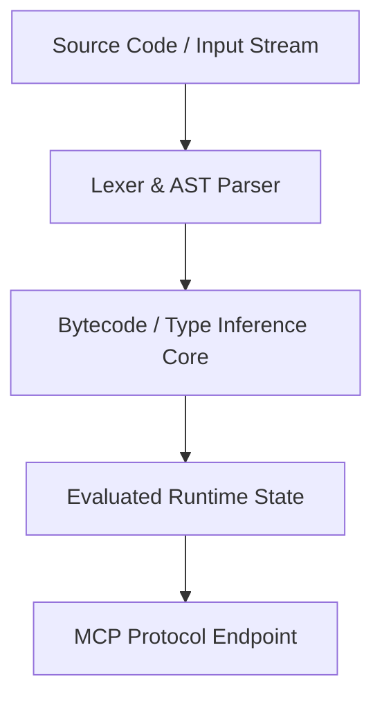

# genpark-lexer-regex-tokenizer-engine-skill

> Deterministic regex lexer and tokenizer generator with source line/column tracking and token stream output.

Part of the **GenPark AI Agent Skills Matrix**. Production-ready, zero external dependencies, native Python 3.9+ standard library.

## Architecture



## Features
- **Zero Third-Party Dependencies**: Pure Python standard library (`re`, `math`).
- **Compiler Construction Fundamentals**: Deterministic lexing, recursive descent parsing, stack bytecode VM, and Algorithm W unification.
- **Native MCP Protocol Support**: Integrated JSON-RPC 2.0 stdio server ready for Claude Desktop, Cursor, and Windsurf.

## Installation

```bash
pip install genpark-lexer-regex-tokenizer-engine-skill
```

Or clone directly:

```bash
git clone https://github.com/alphaparkinc/genpark-lexer-regex-tokenizer-engine-skill.git
cd genpark-lexer-regex-tokenizer-engine-skill
python example_usage.py
```

## Quick Start

```python
from client import *
# Refer to example_usage.py for end-to-end execution
```

## Model Context Protocol (MCP) Setup

Add to your `claude_desktop_config.json` or `cursor.json`:

```json
{
  "mcpServers": {
    "genpark-lexer-regex-tokenizer-engine-skill": {
      "command": "python",
      "args": ["-m", "genpark-lexer-regex-tokenizer-engine-skill.mcp_server"]
    }
  }
}
```

## License
MIT License. Copyright (c) 2026 AlphaPark Inc. & Alpha-Park.
